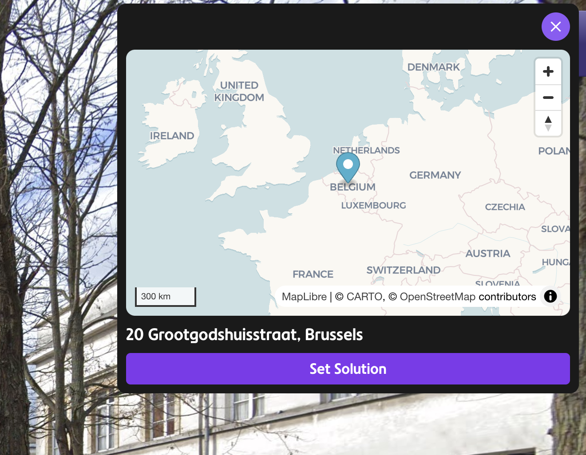

# GeoGuessr Solutions Extension

A Chrome extension that takes advantage of all chrome APIs to find the solution to the current GeoGuessr game (please do not use this in a public game).



## ⚠️ Browser Compatibility

This extension is **only available for Chrome** and Chrome-based browsers (Chromium, Edge, etc.).

## 🚀 Installation

### For End Users (Recommended)

1. Go to the [GitHub Releases](https://github.com/maxencerb/geoguessr-solutions/releases) page
2. Download the latest release ZIP file
3. Extract the ZIP file to a folder on your computer
4. Open Chrome and go to `chrome://extensions/`
5. Enable "Developer mode" in the top right
6. Click "Load unpacked" and select the extracted folder

### For Developers (Custom Installation)

1. Clone this repository:

   ```bash
   git clone https://github.com/maxencerb/geoguessr-solutions.git
   cd geoguessr-solutions
   ```

2. Install dependencies:

   ```bash
   bun install
   ```

3. Build the extension:

   ```bash
   bun run build
   ```

4. Load the extension in Chrome:
   - Open Chrome and go to `chrome://extensions/`
   - Enable "Developer mode" in the top right
   - Click "Load unpacked" and select the `dist` folder from this project

## 🎮 How to Use

### Toggle Extension

- Click on the extension icon in your Chrome toolbar to **toggle between enabling and disabling** the extension
- When enabled, the extension will provide its features on GeoGuessr
- When disabled, the extension will be inactive

## ✨ Features

### 🗺️ Mini Map

- **Auto-displays** when changing levels in GeoGuessr
- Provides a helpful overview of the current location
- Automatically updates as you progress through the game

### 🎯 Place Solution Button

- Automatically places the correct solution on the map
- Saves time by eliminating manual guessing
- Perfect for learning and practice sessions

## 🐛 Known Issues

### Place Solution Button Not Working

If the "Place Solution" button doesn't work:

1. **Try refreshing the page** - this often resolves the issue
2. Make sure the extension is enabled (check the extension icon)
3. Ensure you're on a valid GeoGuessr game page

The issues comes from the fact that the extension injects a middleware into the `google.maps` API, to list all current maps, but the extension can inject it slower than the game loads the map, so the button is not working.

## 🛠️ Development

### Prerequisites

- [Bun](https://bun.sh/) (JavaScript runtime)
- Chrome browser

### Development Commands

```bash
# Build for production
bun run build

# Type checking
bun run check
```

### Project Structure

```
geoguessr-solutions/
├── src/
│   ├── background/     # Background script
│   ├── content/        # Content script and UI
│   ├── lib/           # Shared utilities and types
│   └── popup.svelte   # Extension popup (not used)
├── public/            # Static assets and icons
└── dist/              # Built extension (after build)
```

## 📝 License

This project is private and for educational purposes.

## 🤝 Contributing

This is a private project, but if you have suggestions or find bugs, feel free to report them.

---

**Note**: This extension is designed for educational purposes and to enhance the GeoGuessr learning experience. Please use responsibly and in accordance with GeoGuessr's terms of service.
